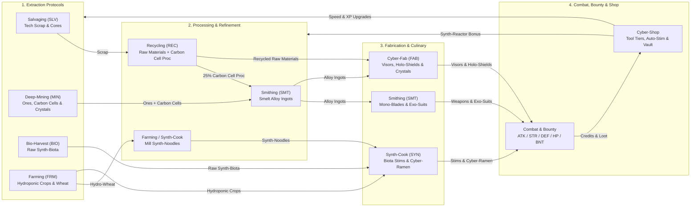

# Routineverse Documentation

Welcome to the **Routineverse** documentation! **Routineverse** is a C++20 cyberpunk idle RPG featuring both a **Qt6 GUI** (`routineverse`) and an **ncursesw TUI** (`routineverse-tui`) backed by a shared simulation library (`libroutineverse`).

## Contents

- **[Logistics & Production Chains (`logistics.md`)](./logistics.md)** — Detailed Mermaid flowcharts and recipe tables for all gathering, recycling, smelting, smithing, cyber-fabrication, hydroponic farming, noodle milling, and cyber-ramen synthesis chains.
- **[Combat, Gear Tiers & Hostile Sectors (`combat.md`)](./combat.md)** — Combat mechanics, 8-tier weapon & cyber-armor progression (`Scrap` through `Quantum`), Auto-Stim thresholds, Bounty contracts, and hostile drop tables.

---

## High-Level Ecosystem & Skill Loop

Routineverse features **13 skills** (**8 non-combat protocols** and **5 combat/bounty skills**) that form an interconnected resource and progression loop:

---

## Skill Overview

| Skill | Short | Category | Primary Role | Tool / Shop Upgrade |
|-------|:-----:|----------|--------------|---------------------|
| **Salvaging** | `SLV` | Extraction | Strip tech scrap, optic fibers, plasma conduits, and AI cores | Salvaging Cutter (T1–T7) |
| **Bio-Harvest** | `BIO` | Extraction | Harvest aquatic synth-biota from Krill to Cyber-Kraken (+5% Data-Cache Cr proc) | Bio-Harvester (T1–T7) |
| **Farming** | `FRM` | Extraction | Cultivate hydroponic crops, mill Synth-Noodles (+20% bonus Hydro-Wheat proc) | Bio-Harvester (T1–T7) |
| **Recycling** | `REC` | Processing | Recycle scrap into Raw Materials (+25% Carbon Cell proc & Credits) | Synth-Reactor (T1–T7) |
| **Synth-Cook** | `SYN` | Culinary | Prep Synth-Noodles, cook Cyber-Ramen bowls, and synthesize Biota Stims | Synth-Reactor (T1–T7) |
| **Deep-Mining** | `MIN` | Extraction | Mine industrial ores and Carbon Cells (+8% rare Data Crystal proc) | Mining Drill (T1–T7) |
| **Smithing** | `SMT` | Fabrication | Smelt ores into Alloy Ingots; forge Mono-Blades and Exo-Suits | Mastery Preservation & Speed |
| **Cyber-Fab** | `FAB` | Fabrication | Combine Alloy Ingots + Recycled Raw Materials into Visors, Shields & Crystals | Mastery Preservation & Speed |
| **Attack** | `ATK` | Combat | Increases melee Accuracy rating and unlocks higher weapon tiers | Mono-Blades (T1–T8) |
| **Strength** | `STR` | Combat | Increases maximum hit damage per weapon cycle | Mono-Blades (T1–T8) |
| **Defence** | `DEF` | Combat | Increases Evasion rating and unlocks higher cyber-armor tiers | Visors, Exo-Suits, Shields (T1–T8) |
| **Hitpoints** | `HP` | Combat | Determines max HP (`Level × 10`) and passive nanite regeneration | Auto-Stim Injector (Mk I–III) |
| **Bounty** | `BNT` | Combat | Unlocks high-security hostile targets and awards Bounty Tokens (`BT`) | Bounty Contracts |

---

## Item Categories

| Category | Display Name | Produced By | Used By / Purpose |
|----------|--------------|-------------|-------------------|
| `Scrap` | Scrap | Salvaging, Hostile Drops | Input for **Recycling** |
| `RawMaterial` | Raw Material | Recycling | Input for **Cyber-Fab** |
| `RawBiota` | Raw Biota | Bio-Harvest | Input for **Synth-Cook** (Stims & Kraken Ramen) |
| `Crop` | Crop/Ingr | Farming, Synth-Cook | Hydroponic crops & **Synth-Noodles** for **Cyber-Ramen** |
| `StimFood` | Stim/Ration | Synth-Cook, Hostile Drops | Loaded into **Stim-Injector** to restore HP in combat |
| `ToxicWaste` | Slag | Synth-Cook (failed synthesis) | Can be liquidated for 1 Cr |
| `RawOre` | Ore | Deep-Mining, Recycling (`CarbonCell` proc), Drops | Input for **Smithing** (smelting ingots) |
| `Alloy` | Alloy | Smithing | Input for **Smithing** (Blades/Exo-Suits) and **Cyber-Fab** (Visors/Shields/Crystals) |
| `DataCrystal` | Crystal | Cyber-Fab, Deep-Mining (8% proc), Drops | High-value tradeable tech cores |
| `Weapon` | Weapon | Smithing, Hostile Drops | Equippable in `Weapon` slot (+Attack, +Strength) |
| `Visor` | Visor | Cyber-Fab | Equippable in `Visor` slot (+Defence, +% DR) |
| `ExoSuit` | Exo-Suit | Smithing, Hostile Drops | Equippable in `Exo-Suit` slot (+Defence, +% DR) |
| `HoloShield` | Shield | Cyber-Fab | Equippable in `Holo-Shield` slot (+Defence, +% DR) |
| `CyberLoot` | Salvage | Hostile Drops | Tradeable mechanical salvage for Credits |
