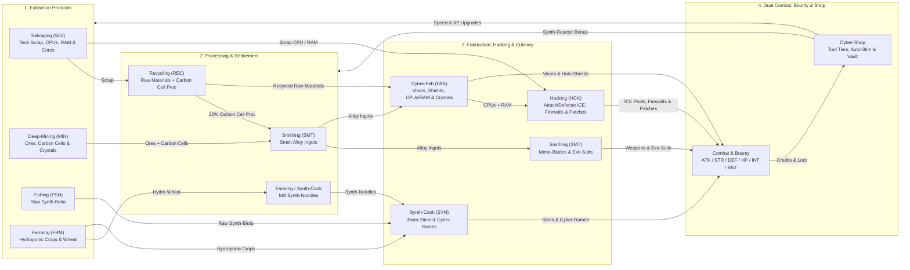

# Routineverse Documentation

Welcome to the **Routineverse** documentation! **Routineverse** is a C++20 cyberpunk idle RPG featuring both a **Qt6 GUI** (`routineverse`) and an **ncursesw TUI** (`routineverse-tui`) backed by a shared simulation library (`libroutineverse`).

## Contents

- **[Logistics & Production Chains (`logistics.md`)](./logistics.md)** — Detailed Mermaid flowcharts and recipe tables for all gathering, recycling, smelting, smithing, cyber-fabrication (gear, data crystals & CPU/RAM hardware), hydroponic farming, noodle milling, and cyber-ramen synthesis chains.
- **[Hacking, ICE Pools & Cyber-Warfare (`hacking.md`)](./hacking.md)** — Complete guide to the **Hacking (`HCK`)** and **Integrity (`INT`)** skills, CPU & RAM hardware components, Attack ICE & Defense/Repair ICE pools, 6-tier **Firewalls (`EquipSlot::Firewall`)**, Integrity Patches, and Metaverse Grid cyber-combat formulas.
- **[Combat, Gear Tiers & Hostile Sectors (`combat.md`)](./combat.md)** — Dual **Hitpoints (HP) + Integrity (INT)** combat mechanics, 8-tier weapon & cyber-armor progression (`Scrap` through `Quantum`), Auto-Stim & Defense ICE auto-repair thresholds, Bounty contracts, and all 16 hostile drop tables.

---

## High-Level Ecosystem & Skill Loop

Routineverse features **15 skills** (**9 non-combat protocols** and **6 combat/bounty skills**) that form an interconnected resource and progression loop:

---

## Skill Overview

| Skill | Short | Category | Primary Role | Tool / Loadout Upgrade |
|-------|:-----:|----------|--------------|------------------------|
| **Salvaging** | `SLV` | Extraction | Strip tech scrap, Scrap CPUs/RAM, optic fibers, plasma conduits, and AI cores | Salvaging Cutter (T1–T7) |
| **Fishing** | `FSH` | Extraction | Harvest aquatic synth-biota from Krill to Cyber-Kraken (+5% Data-Cache Cr proc) | Bio-Harvester (T1–T7) |
| **Farming** | `FRM` | Extraction | Cultivate hydroponic crops, mill Synth-Noodles (+20% bonus Hydro-Wheat proc) | Bio-Harvester (T1–T7) |
| **Recycling** | `REC` | Processing | Recycle scrap into Raw Materials (+25% Carbon Cell proc & Credits) | Synth-Reactor (T1–T7) |
| **Synth-Cook** | `SYN` | Culinary | Prep Synth-Noodles, cook Cyber-Ramen bowls, and synthesize Biota Stims | Synth-Reactor (T1–T7) |
| **Deep-Mining** | `MIN` | Extraction | Mine industrial ores and Carbon Cells (+8% rare Data Crystal proc) | Mining Drill (T1–T7) |
| **Smithing** | `SMT` | Fabrication | Smelt ores into Alloy Ingots; forge Mono-Blades and Exo-Suits | Mastery Preservation & Speed |
| **Cyber-Fab** | `FAB` | Fabrication | Combine Alloy Ingots + Raw Materials into Visors, Shields, CPUs/RAM & Crystals | Mastery Preservation & Speed |
| **Hacking** | `HCK` | Cyberware / Net | Code Attack ICE, Defense/Repair ICE, Firewalls & Integrity Patches; scales ICE hit | Attack ICE Pool (v1.0–v6.0) |
| **Attack** | `ATK` | Combat | Increases melee Accuracy rating and unlocks higher weapon tiers | Mono-Blades (T1–T8) |
| **Strength** | `STR` | Combat | Increases maximum physical hit damage per weapon cycle | Mono-Blades (T1–T8) |
| **Defence** | `DEF` | Combat | Increases Evasion rating and unlocks higher cyber-armor tiers | Head, Armor, Shield (T1–T8) |
| **Hitpoints** | `HP` | Combat | Determines max HP (`Level × 10`, starts at Lv 10 = 100 HP) and nanite regen | Auto-Stim Injector (Mk I–III) |
| **Integrity** | `INT` | Combat | Determines max Integrity (`Level × 10 + Firewall`, starts at Lv 10 = 100 INT) | Firewalls (T1–T6) & Defense ICE |
| **Bounty** | `BNT` | Combat | Unlocks high-security physical & Metaverse Grid targets and awards Bounty Tokens (`BT`) | Bounty Contracts |

---

## Item Categories

| Category | Display Name | Produced By | Used By / Purpose |
|----------|--------------|-------------|-------------------|
| `Scrap` | Scrap | Salvaging, Hostile Drops | Input for **Recycling** |
| `RawMaterial` | Raw Material | Recycling | Input for **Cyber-Fab** and **Hacking** |
| `RawBiota` | Raw Biota | Fishing | Input for **Synth-Cook** (Stims & Kraken Ramen) |
| `Crop` | Crop/Ingr | Farming, Synth-Cook | Hydroponic crops & **Synth-Noodles** for **Cyber-Ramen** |
| `StimFood` | Stim/Ration | Synth-Cook, Hostile Drops | Loaded into **Stim-Injector** to restore HP in combat |
| `ToxicWaste` | Slag | Synth-Cook (failed synthesis) | Can be liquidated for 1 Cr |
| `RawOre` | Ore | Deep-Mining, Recycling (`CarbonCell` proc), Drops | Input for **Smithing** (ingots) and **Cyber-Fab** (`SiliconOre`) |
| `Alloy` | Alloy | Smithing | Input for **Smithing** (Blades/Exo-Suits) and **Cyber-Fab** (Visors/Shields/CPUs/Crystals) |
| `DataCrystal` | Crystal | Cyber-Fab, Deep-Mining (8% proc), Drops | High-value tech cores & inputs for high-tier Firewalls/RAM |
| `Hardware` | Hardware | Salvaging, Cyber-Fab, Hostile Drops | **CPUs** & **RAM** modules used as inputs for **Hacking** |
| `Weapon` | Weapon | Smithing, Hostile Drops | Equippable in `Weapon` slot (+Attack, +Strength) |
| `Head` | Head | Cyber-Fab | Equippable in `Head` slot (+Defence, +% DR) |
| `Armor` | Armor | Smithing, Hostile Drops | Equippable in `Armor` slot (+Defence, +% DR) |
| `Shield` | Shield | Cyber-Fab | Equippable in `Shield` slot (+Defence, +% DR) |
| `Firewall` | Firewall | Hacking, Hostile Drops | Equippable in `Firewall` slot (+Max INT, +Cyber Evasion, +ICE DR%) |
| `AttackIce` | Attack ICE | Hacking, Hostile Drops | Loaded into **Attack ICE Pool** (+Cyber Accuracy, +ICE Max Hit; 1 consumed/attack) |
| `DefenseIce` | Defense ICE | Hacking | Loaded into **Defense ICE Pool** (+Cyber Evasion, +ICE DR%, auto-repairs INT) |
| `IntegrityPatch` | INT Patch | Hacking, Hostile Drops | Restores **Integrity** (`+INT`) and/or grants permanent **Integrity XP** |
| `Cutter` / `Harvester` / `Drill` / `Reactor` / `AutoStim` | Tools | Cyber-Shop, Hostile Drops | Equippable in tool slots to reduce skill cycle time or raise Auto-Stim threshold |
| `CyberLoot` | Salvage | Hostile Drops | Tradeable mechanical salvage for Credits |
