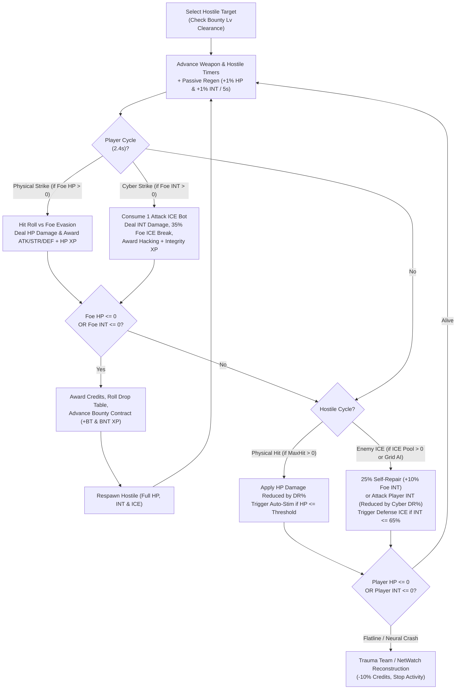

```mermaid
flowchart LR
  T1["Tier 1: Scrap<br/>(Req Lv 1, Tot DR: 4%)"] --> T2["Tier 2: Titanium<br/>(Req Lv 5, Tot DR: 7%)"]
  T2 --> T3["Tier 3: Durasteel<br/>(Req Lv 10, Tot DR: 11%)"]
  T3 --> T4["Tier 4: Cobalt<br/>(Req Lv 20, Tot DR: 16%)"]
  T4 --> T5["Tier 5: Tungsten<br/>(Req Lv 30, Tot DR: 20%)"]
  T5 --> T6["Tier 6: Neutronium<br/>(Req Lv 40, Tot DR: 27%)"]
  T6 --> T7["Tier 7: Chrono<br/>(Req Lv 60, Tot DR: 38%)"]
  T7 --> T8["Tier 8: Quantum<br/>(Req Lv 75, Tot DR: 48%)"]
```

# Combat, Gear Tiers & Hostile Sectors

This document covers the dual **Hitpoints (HP) + Integrity (INT)** combat simulation loop, the **8 tiers of weapons and cyber-armor** (`Scrap` through `Quantum`), Bounty contracts, and all **16 hostile targets** across physical and **Metaverse Grid** sectors.

For **Attack & Defense ICE Pools**, **Firewalls (`EquipSlot::Firewall`)**, and **Integrity Patches**, see **[Hacking, ICE Pools & Cyber-Warfare (`hacking.md`)](./hacking.md)**.

---

## 1. Dual Combat (HP & Integrity) & Bounty Loop

Combat in **Routineverse** operates simultaneously on two planes:
1. **Physical Plane (`HP`)**: Melee weapons strike enemy `HP`, while enemy physical attacks damage your `HP` (mitigated by Armor/Visor/Shield `DR%` and healed by the **Auto-Stim Injector**).
2. **Cyber / Metaverse Plane (`INT`)**: Loaded **Attack ICE** bots strike enemy `Integrity` (`INT`) and have a **35% chance on hit to destroy 1 enemy ICE bot**, while enemy ICE bots either self-repair the enemy's Integrity (25% chance when damaged) or attack your `Integrity` (mitigated by Firewall/Defense ICE `Cyber DR%` and auto-repaired by **Defense ICE** at $\le 65\%$ Integrity).

- **Dual Victory Condition**: Depleting **either** a target's `HP` (if `max_hp > 0`) **or** its `Integrity` (if `max_integrity > 0`) immediately neutralizes the hostile!
- **Three Hostile Archetypes**:
  - **Unconnected Hostiles (`max_hp > 0, max_integrity = 0`)**: Found in the **Neon Slums** (`Stray Servo-Drone`, `Bio-Vat Hound`, `Street Scavenger`) and organic mutants (`Chem-Mutant Brute`). They are not connected to the net—Attack ICE is never consumed against them, and they must be defeated via physical `HP` damage.
  - **Pure Metaverse Terminals & AIs (`max_hp = 0, max_integrity > 0`)**: Found in the **Metaverse Grid** (`Slum Data-Terminal`, `Corp Subroutine AI`, `Blackwall Daemon`, `Archon-Net Overmind`). They have no physical body and can only be damaged via **Attack ICE** (or neural deck cyber pulses), while attacking your `Integrity` directly.
  - **Connected Hybrid Hostiles (`max_hp > 0, max_integrity > 0`)**: Networked cyborgs, security mechs, and **NEXUS-9**. They fight with both physical weapons and an active **ICE Pool**, and can be defeated by zeroing out either their `HP` or their `Integrity`.

---

## 2. 8-Tier Weapon & Cyber-Armor Progression

Weapons (`EquipSlot::Weapon`) and Exo-Suits (`EquipSlot::Armor`) are forged via **Smithing**, while Visors (`EquipSlot::Head`) and Holo-Shields (`EquipSlot::Shield`) are fabricated via **Cyber-Fab**. In addition, operatives can equip 6 tiers of **Firewalls** (`EquipSlot::Firewall`) coded via **Hacking** (see [`hacking.md`](./hacking.md#4-firewalls--barriers-equipslotfirewall)).

### Complete Physical Gear Stats Table

| Tier | Material | Req Lv | Mono-Blade (`Atk / Str`) | Visor (`Def / DR%`) | Exo-Suit (`Def / DR%`) | Holo-Shield (`Def / DR%`) | Full Set Bonus (`Def / DR%`) |
|:----:|----------|:------:|--------------------------|---------------------|------------------------|---------------------------|:----------------------------:|
| **1** | **Scrap** | Lv 1 | `+10 Atk / +12 Str` | `+6 Def / 1% DR` | `+14 Def / 2% DR` | `+9 Def / 1% DR` | `+29 Def / 4% DR` |
| **2** | **Titanium** | Lv 5 | `+18 Atk / +20 Str` | `+11 Def / 2% DR` | `+24 Def / 3% DR` | `+16 Def / 2% DR` | `+51 Def / 7% DR` |
| **3** | **Durasteel** | Lv 10 | `+28 Atk / +32 Str` | `+18 Def / 3% DR` | `+36 Def / 5% DR` | `+25 Def / 3% DR` | `+79 Def / 11% DR` |
| **4** | **Cobalt** | Lv 20 | `+42 Atk / +48 Str` | `+27 Def / 4% DR` | `+52 Def / 7% DR` | `+36 Def / 5% DR` | `+115 Def / 16% DR` |
| **5** | **Tungsten** | Lv 30 | `+60 Atk / +66 Str` | `+38 Def / 5% DR` | `+74 Def / 9% DR` | `+50 Def / 6% DR` | `+162 Def / 20% DR` |
| **6** | **Neutronium** | Lv 40 | `+84 Atk / +92 Str` | `+52 Def / 7% DR` | `+102 Def / 12% DR` | `+68 Def / 8% DR` | `+222 Def / 27% DR` |
| **7** | **Chrono** | Lv 60 | `+120 Atk / +130 Str` | `+72 Def / 10% DR` | `+140 Def / 16% DR` | `+96 Def / 12% DR` | `+308 Def / 38% DR` |
| **8** | **Quantum** | Lv 75 | `+165 Atk / +180 Str` | `+98 Def / 13% DR` | `+190 Def / 20% DR` | `+132 Def / 15% DR` | `+420 Def / 48% DR` |

---

## 3. Hostile Sectors & Salvage Drop Tables

| Hostile Target | Sector | Lv | Bounty Req | HP | INT | Phys / ICE Hit | ICE Pool | Credits | Salvage, Hardware, ICE & Gear Drops |
|----------------|--------|---:|-----------:|---:|----:|:--------------:|:--------:|--------:|-------------------------------------|
| **Stray Servo-Drone** | Neon Slums | 1 | Lv 1 | 30 | 0 | `6 / 0` | 0 | 3–10 Cr | `Microchip` (90%), `Scrap Logic CPU` (45%), `Scrap DRAM Stick` (45%), `Rusty Plasma Torch` (12%) |
| **Bio-Vat Hound** | Neon Slums | 4 | Lv 1 | 65 | 0 | `12 / 0` | 0 | 8–22 Cr | `Synth-Weave Hide` (85%), `Synth-Protein Bar` (70%), `Servo Parts` (100%), `Titanium Bio-Net` (10%) |
| **Slum Data-Terminal** | Metaverse Grid | 5 | Lv 1 | 0 | 60 | `0 / 9` | 3 | 12–30 Cr | `Scrap Logic CPU` (85%), `Scrap DRAM Stick` (85%), `Spike-ICE v1.0` (60%), `Parity Checksum Patch` (40%) |
| **Street Scavenger** | Neon Slums | 9 | Lv 1 | 110 | 0 | `20 / 0` | 0 | 18–45 Cr | `Plasteel Shards` (50%), `Synth-Carp Pack` (40%), `Servo Parts` (100%), `Titanium Arc Cutter` (10%) |
| **Chrome Gang Punk** | Back-Alley Sector | 14 | Lv 1 | 160 | 90 | `28 / 10` | 2 | 28–70 Cr | `Scrap Vibro-Knife` (15%), `Titanium Ore` (45%), `Spike-ICE v1.0` (50%), `Titanium Core Drill` (10%) |
| **Riot Enforcer Bot** | Industrial Sector | 24 | Lv 10 | 280 | 180 | `45 / 18` | 3 | 55–130 Cr | `Heavy Mech Chassis` (100%), `Durasteel Katana` (12%), `Positronic Multi-Core CPU` (35%), `Durasteel Laser Saw` (10%) |
| **Corp Subroutine AI** | Metaverse Grid | 28 | Lv 15 | 0 | 260 | `0 / 32` | 5 | 75–175 Cr | `Positronic Multi-Core CPU` (75%), `Optic-NAND Storage Bank` (75%), `Breach-ICE v2.0` (55%), `Kernel Hotfix Script` (40%) |
| **Chem-Mutant Brute** | Industrial Sector | 36 | Lv 20 | 450 | 0 | `68 / 0` | 0 | 95–220 Cr | `Heavy Mech Chassis` (100%), `Cobalt Ore` (45%), `Cyber-Lobster Meal` (35%), `Durasteel Sonar Rig` (10%) |
| **Cryo-Sec Mech** | Industrial Sector | 48 | Lv 30 | 650 | 420 | `92 / 42` | 4 | 150–340 Cr | `Heavy Mech Chassis` (100%), `Cobalt Subdermal Rig` (10%), `Sapphire Cortex` (25%), `Cobalt Laser Bore` (8%) |
| **Blackwall Daemon** | Metaverse Grid | 58 | Lv 38 | 0 | 750 | `0 / 78` | 7 | 220–500 Cr | `Quantum Co-Processor` (70%), `Cryo-Holographic RAM` (70%), `Kraken-ICE v4.0` (50%), `Neural Blackwall Barrier` (12%) |
| **Corp Shadow-Op** | Megacorp Plaza | 60 | Lv 40 | 880 | 600 | `125 / 60` | 5 | 230–520 Cr | `Tungsten Mantis-Blade` (12%), `Tungsten Ore` (45%), `Plasma Ray Infusion` (40%), `Positronic Synth-Core` (8%) |
| **Cobalt Cyber-Ninja** | Megacorp Plaza | 74 | Lv 50 | 1,150 | 800 | `160 / 80` | 6 | 350–780 Cr | `Tungsten Power-Armor` (10%), `Ruby Laser Core` (30%), `Apex Shark Booster` (35%), `Tungsten Vibro-Ripper` (8%) |
| **Neutronium Cyborg** | Megacorp Plaza | 88 | Lv 65 | 1,500 | 1,100 | `205 / 110` | 7 | 550–1,200 Cr | `Neutronium Phase-Saber` (10%), `Neutronium Nano-Suit` (8%), `Emerald Cryptokey` (30%), `Neutronium Tectonic Drill` (7%) |
| **Archon-Net Overmind** | Metaverse Grid | 95 | Lv 70 | 0 | 1,900 | `0 / 165` | 10 | 750–1,700 Cr | `Neural Overmind CPU` (75%), `Quantum Qubit Vault` (75%), `Overmind-ICE v6.0` (50%), `Quantum Encryption Barrier` (10%) |
| **Apex Cyber-Wyrm** | Orbital Spire | 110 | Lv 75 | 2,150 | 1,600 | `270 / 150` | 8 | 900–2,000 Cr | `Apex Cyber-Core` (100%), `Chrono-Edge Katana` (15%), `Quantum Singularity Ore` (30%), `Chrono Stasis Harvester` (6%) |
| **NEXUS-9, Rogue Overmind** | Mainframe Core `[BOSS]` | 150 | Lv 85 | 3,500 | 3,000 | `360 / 220` | 12 | 2,500–5,500 Cr | `Quantum Singularity Blade` (15%), `Quantum Phase Exo-Suit` (12%), `Singularity AI Bastion` (10%), `Mainframe Singularity Core` (5%) |
