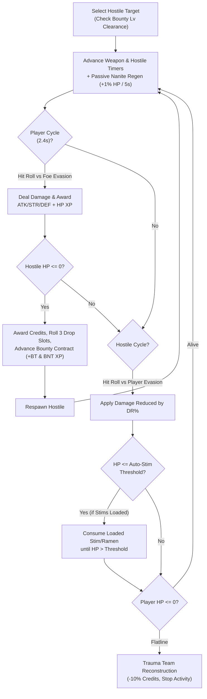

# Combat, Gear Tiers & Hostile Sectors

This document covers the combat simulation loop, the **8 tiers of weapons and cyber-armor** (`Scrap` through `Quantum`), Bounty contracts, and hostile drop tables.

---

## 1. Combat & Bounty Loop

---

## 2. 8-Tier Weapon & Cyber-Armor Progression

Weapons (`EquipSlot::Weapon`) and Exo-Suits (`EquipSlot::Armor`) are forged via **Smithing**, while Visors (`EquipSlot::Head`) and Holo-Shields (`EquipSlot::Shield`) are fabricated via **Cyber-Fab**.

```mermaid
flowchart LR
  T1["Tier 1: Scrap<br/>(Req Lv 1, Tot DR: 4%)"] --> T2["Tier 2: Titanium<br/>(Req Lv 5, Tot DR: 7%)"]
  T2 --> T3["Tier 3: Durasteel<br/>(Req Lv 10, Tot DR: 11%)"]
  T3 --> T4["Tier 4: Cobalt<br/>(Req Lv 20, Tot DR: 16%)"]
  T4 --> T5["Tier 5: Tungsten<br/>(Req Lv 30, Tot DR: 20%)"]
  T5 --> T6["Tier 6: Neutronium<br/>(Req Lv 40, Tot DR: 27%)"]
  T6 --> T7["Tier 7: Chrono<br/>(Req Lv 60, Tot DR: 38%)"]
  T7 --> T8["Tier 8: Quantum<br/>(Req Lv 75, Tot DR: 48%)"]
```

### Complete Gear Stats Table

| Tier | Material | Req Lv | Mono-Blade (`Atk / Str`) | Visor (`Def / DR%`) | Exo-Suit (`Def / DR%`) | Holo-Shield (`Def / DR%`) | Full Set Bonus (`Def / DR%`) |
|:----:|----------|:------:|--------------------------|---------------------|------------------------|---------------------------|:----------------------------:|
| **1** | **Scrap** | Lv 1 | `+10 Atk / +12 Str` | `+6 Def / 1% DR` | `+14 Def / 2% DR` | `+9 Def / 1% DR` | `+29 Def / 4% DR` |
| **2** | **Titanium** | Lv 5 | `+18 Atk / +20 Str` | `+11 Def / 2% DR` | `+24 Def / 3% DR` | `+16 Def / 2% DR` | `+51 Def / 7% DR` |
| **3** | **Durasteel** | Lv 10 | `+28 Atk / +32 Str` | `+18 Def / 3% DR` | `+36 Def / 5% DR` | `+25 Def / 3% DR` | `+79 Def / 11% DR` |
| **4** | **Cobalt** | Lv 20 | `+42 Atk / +48 Str` | `+27 Def / 4% DR` | `+52 Def / 7% DR` | `+36 Def / 5% DR` | `+115 Def / 16% DR` |
| **5** | **Tungsten** | Lv 30 | `+60 Atk / +66 Str` | `+38 Def / 5% DR` | `+74 Def / 9% DR` | `+50 Def / 6% DR` | `+162 Def / 20% DR` |
| **6** | **Neutronium** | Lv 40 | `+84 Atk / +92 Str` | `+52 Def / 7% DR` | `+102 Def / 12% DR` | `+68 Def / 8% DR` | `+222 Def / 27% DR` |
| **7** | **Chrono** | Lv 60 | `+120 Atk / +130 Str` | `+72 Def / 10% DR` | `+140 Def / 16% DR` | `+96 Def / 12% DR` | `+308 Def / 38% DR` |
| **8** | **Quantum** | Lv 75 | `+165 Atk / +180 Str` | `+98 Def / 13% DR` | `+190 Def / 20% DR` | `+132 Def / 15% DR` | `+420 Def / 48% DR` |

---

## 3. Hostile Sectors & Salvage Drop Tables

| Hostile Target | Sector | Combat Lv | Bounty Req | HP | Max Hit | Credits | Notable Salvage & Gear Drops |
|----------------|--------|----------:|-----------:|---:|--------:|--------:|------------------------------|
| **Stray Servo-Drone** | Neon Slums | 1 | Lv 1 | 30 | 6 | 3–10 Cr | `Microchip` (90%), `Servo Parts` (100%), `Krill Ration` (25%) |
| **Bio-Vat Hound** | Neon Slums | 4 | Lv 1 | 65 | 12 | 8–22 Cr | `Synth-Weave Hide` (85%), `Synth-Protein Bar` (70%), `Servo Parts` (100%) |
| **Street Scavenger** | Neon Slums | 9 | Lv 1 | 110 | 20 | 18–45 Cr | `Plasteel Shards` (50%), `Synth-Carp Pack` (40%), `Servo Parts` (100%) |
| **Chrome Gang Punk** | Back-Alley Sector | 14 | Lv 1 | 160 | 28 | 28–70 Cr | `Scrap Vibro-Knife` (15%), `Titanium Ore` (45%), `Servo Parts` (100%) |
| **Riot Enforcer Bot** | Industrial Sector | 24 | Lv 10 | 280 | 45 | 55–130 Cr | `Heavy Mech Chassis` (100%), `Durasteel Katana` (12%), `Carbon Cell` (40%) |
| **Chem-Mutant Brute** | Industrial Sector | 36 | Lv 20 | 450 | 68 | 95–220 Cr | `Heavy Mech Chassis` (100%), `Cobalt Ore` (45%), `Cyber-Lobster Meal` (35%) |
| **Cryo-Sec Mech** | Industrial Sector | 48 | Lv 30 | 650 | 92 | 150–340 Cr | `Heavy Mech Chassis` (100%), `Cobalt Subdermal Rig` (10%), `Sapphire Cortex` (25%) |
| **Corp Shadow-Op** | Megacorp Plaza | 60 | Lv 40 | 880 | 125 | 230–520 Cr | `Tungsten Mantis-Blade` (12%), `Tungsten Ore` (45%), `Plasma Ray Infusion` (40%) |
| **Cobalt Cyber-Ninja** | Megacorp Plaza | 74 | Lv 50 | 1,150 | 160 | 350–780 Cr | `Tungsten Power-Armor` (10%), `Ruby Laser Core` (30%), `Apex Shark Booster` (35%) |
| **Neutronium Cyborg** | Megacorp Plaza | 88 | Lv 65 | 1,500 | 205 | 550–1,200 Cr | `Neutronium Phase-Saber` (10%), `Neutronium Nano-Suit` (8%), `Emerald Cryptokey` (30%) |
| **Apex Cyber-Wyrm** | Orbital Spire | 110 | Lv 75 | 2,150 | 270 | 900–2,000 Cr | `Apex Cyber-Core` (100%), `Chrono-Edge Katana` (15%), `Quantum Singularity Ore` (30%) |
| **NEXUS-9, Rogue Overmind** | Mainframe Core `[BOSS]` | 150 | Lv 85 | 3,500 | 360 | 2,500–5,500 Cr | `Quantum Singularity Blade` (15%), `Quantum Phase Exo-Suit` (12%), `Kraken Bio-Elixir` (60%) |
