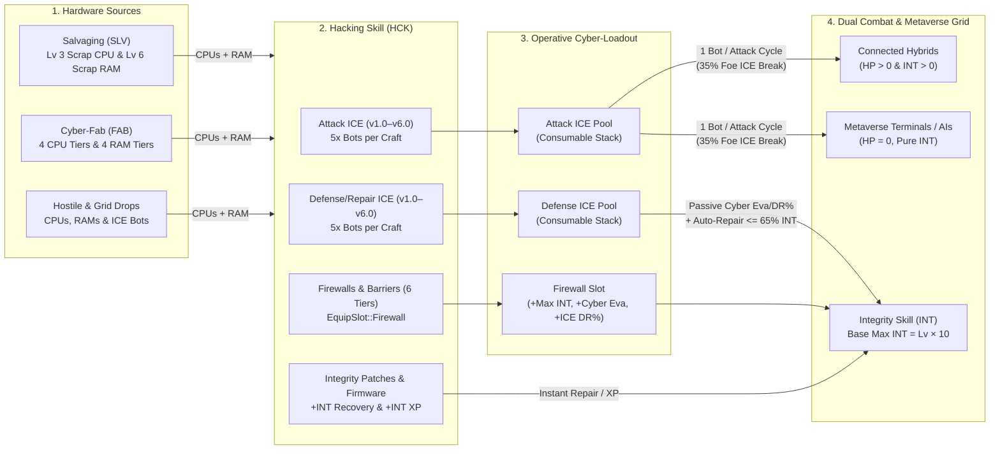

# Hacking, ICE Pools & Cyber-Warfare

This document details the **Hacking (`HCK`)** and **Integrity (`INT`)** skills, **CPU & RAM** hardware fabrication, **Attack & Defense ICE** pools, **Firewalls (`EquipSlot::Firewall`)**, **Integrity Patches**, and **Metaverse Grid** cyber-combat mechanics in **Routineverse**.

---

## 1. Cyber-Warfare & Hacking Ecosystem

---

## 2. Hardware Components (`ItemCategory::Hardware`)

Coding ICE bots, Firewalls, and Integrity Patches requires **CPU processors** and **RAM storage modules**. Low-tier hardware can be scavenged directly via **Salvaging**, while mid-to-endgame hardware is fabricated in **Cyber-Fab** or looted from **Metaverse Grid** hostiles.

| Hardware Item | Type | Tier | Value | Salvaging / Drop Source | Cyber-Fab Recipe (`SkillType::CyberFab`) |
|---------------|:----:|:----:|------:|-------------------------|------------------------------------------|
| **Scrap Logic CPU** | CPU | T1 | 12 Cr | `Salvaging` Lv 3 (`3.2s`, 20 XP), `Stray Servo-Drone` (45%), `Slum Data-Terminal` (85%) | Lv 8 (`2.4s`, 45 XP): `1x Silicon Ore + 1x Copper Filament` |
| **Scrap DRAM Stick** | RAM | T1 | 10 Cr | `Salvaging` Lv 6 (`3.3s`, 24 XP), `Stray Servo-Drone` (45%), `Slum Data-Terminal` (85%) | Lv 10 (`2.4s`, 48 XP): `1x Silicon Ore + 1x Copper Wire Scrap` |
| **Positronic Multi-Core CPU** | CPU | T2 | 95 Cr | `Riot Enforcer Bot` (35%), `Corp Subroutine AI` (75%) | Lv 32 (`2.8s`, 145 XP): `1x Positronic Wafer + 1x Silver Conductor` |
| **Optic-NAND Storage Bank** | RAM | T2 | 85 Cr | `Corp Subroutine AI` (75%) | Lv 36 (`2.8s`, 155 XP): `1x Optic Silica Glass + 1x Carbon Fiber Weave` |
| **Quantum Co-Processor** | CPU | T3 | 340 Cr | `Blackwall Daemon` (70%) | Lv 58 (`3.0s`, 270 XP): `1x Quantum Lattice + 1x Gold Superconductor` |
| **Cryo-Holographic RAM** | RAM | T3 | 310 Cr | `Blackwall Daemon` (70%) | Lv 60 (`3.0s`, 280 XP): `1x Cryo-Coolant Gel + 1x Positronic Wafer` |
| **Neural Overmind CPU** | CPU | T4 | 920 Cr | `Archon-Net Overmind` (75%) | Lv 85 (`3.6s`, 680 XP): `1x Neural Matrix + 1x Chrono-Alloy Ingot` |
| **Quantum Qubit Vault** | RAM | T4 | 860 Cr | `Archon-Net Overmind` (75%) | Lv 87 (`3.6s`, 710 XP): `1x Quantum Lattice + 1x Sapphire Cortex` |

---

## 3. ICE Pools (`AttackIce` & `DefenseIce`)

Unlike permanent gear slots, **ICE Pools** work as stackable, consumable companion pools (`equipment.attack_ice_item` / `attack_ice_qty` and `equipment.defense_ice_item` / `defense_ice_qty`):
- Equipping an ICE item from your Cyber-Vault loads the **entire stack** into your active Attack ICE or Defense ICE pool (swapping any previously loaded ICE type back to the Vault).
- **Attack ICE Pool**:
  - Activates automatically alongside your weapon cycle whenever fighting a target with **Integrity (`max_integrity > 0`)**.
  - Consumes **1 Attack ICE bot** per attack cycle (never consumed against unconnected `0 INT` enemies in the Neon Slums).
  - Deals cyber damage to the enemy's Integrity (`Hacking` & `Integrity` XP awarded) and has a **35% chance on hit to destroy 1 enemy ICE bot** (`monster_ice_qty`).
- **Defense / Repair ICE Pool**:
  - While at least 1 Defense ICE bot is loaded in the pool, it passively grants **Cyber Evasion (`+Def`)** and **ICE Damage Reduction (`+DR%`)**.
  - Whenever your Integrity drops to **$\le 65\%$ of Max Integrity** (or $\le$ your Auto-Stim threshold), 1 Defense ICE bot is automatically consumed to **repair your Integrity**.

### Attack ICE Progression (`ItemCategory::AttackIce`)

| Tier | Attack ICE Bot | Req Hacking Lv | Cyber Accuracy (`+Atk`) | ICE Max Hit (`+Str`) | Unit Value |
|:----:|----------------|:--------------:|:-----------------------:|:--------------------:|-----------:|
| **v1.0** | **Spike-ICE v1.0** | Lv 1 | `+12 Cyber Acc` | `+14 ICE Str` | 8 Cr |
| **v2.0** | **Breach-ICE v2.0** | Lv 20 | `+24 Cyber Acc` | `+28 ICE Str` | 25 Cr |
| **v3.0** | **Viper-ICE v3.0** | Lv 40 | `+42 Cyber Acc` | `+48 ICE Str` | 65 Cr |
| **v4.0** | **Kraken-ICE v4.0** | Lv 60 | `+68 Cyber Acc` | `+76 ICE Str` | 160 Cr |
| **v5.0** | **Wraith-ICE v5.0** | Lv 80 | `+102 Cyber Acc` | `+115 ICE Str` | 380 Cr |
| **v6.0** | **Overmind-ICE v6.0** | Lv 92 | `+150 Cyber Acc` | `+170 ICE Str` | 850 Cr |

### Defense & Repair ICE Progression (`ItemCategory::DefenseIce`)

| Tier | Defense ICE Bot | Req Hacking Lv | Integrity Repair (`+INT`) | Passive Cyber Evasion (`+Def`) | Passive ICE Barrier (`+DR%`) | Unit Value |
|:----:|-----------------|:--------------:|:-------------------------:|:------------------------------:|:----------------------------:|-----------:|
| **v1.0** | **Watchdog-ICE v1.0** | Lv 1 | `+30 INT` | `+8 Cyber Eva` | `5% ICE DR` | 10 Cr |
| **v2.0** | **SysMedic-ICE v2.0** | Lv 20 | `+65 INT` | `+18 Cyber Eva` | `9% ICE DR` | 30 Cr |
| **v3.0** | **Aegis-ICE v3.0** | Lv 40 | `+130 INT` | `+32 Cyber Eva` | `14% ICE DR` | 75 Cr |
| **v4.0** | **Seraph-ICE v4.0** | Lv 60 | `+240 INT` | `+50 Cyber Eva` | `19% ICE DR` | 185 Cr |
| **v5.0** | **Archon-ICE v5.0** | Lv 80 | `+400 INT` | `+75 Cyber Eva` | `25% ICE DR` | 420 Cr |
| **v6.0** | **Bastion-ICE v6.0** | Lv 95 | `+650 INT` | `+110 Cyber Eva` | `32% ICE DR` | 950 Cr |

---

## 4. Firewalls & Barriers (`EquipSlot::Firewall`)

**Firewalls** (`ItemCategory::Firewall`) are permanent cyberware barriers equipped in the dedicated `Firewall` slot (`EquipSlot::Firewall`). They require **Integrity** skill levels to equip and boost your **Max Integrity**, **Cyber Evasion**, and **ICE Damage Reduction %**.

| Tier | Firewall / Barrier | Req Integrity Lv | Max Integrity Bonus (`+INT`) | Cyber Evasion (`+Def`) | ICE Damage Reduction (`+DR%`) | Value |
|:----:|--------------------|:----------------:|:----------------------------:|:----------------------:|:-----------------------------:|------:|
| **1** | **Packet Filter Firewall** | Lv 1 | `+25 Max INT` | `+10 Cyber Eva` | `6% ICE DR` | 65 Cr |
| **2** | **Proxy-Mesh Barrier** | Lv 20 | `+60 Max INT` | `+24 Cyber Eva` | `12% ICE DR` | 260 Cr |
| **3** | **Neural Blackwall Barrier** | Lv 45 | `+120 Max INT` | `+45 Cyber Eva` | `18% ICE DR` | 850 Cr |
| **4** | **Cryo-Lattice Aegis** | Lv 65 | `+200 Max INT` | `+70 Cyber Eva` | `25% ICE DR` | 2,400 Cr |
| **5** | **Quantum Encryption Barrier** | Lv 80 | `+320 Max INT` | `+105 Cyber Eva` | `32% ICE DR` | 6,800 Cr |
| **6** | **Singularity AI Bastion** | Lv 92 | `+480 Max INT` | `+150 Cyber Eva` | `40% ICE DR` | 16,500 Cr |

---

## 5. Integrity Recovery & Firmware Patches (`ItemCategory::IntegrityPatch`)

Using (equipping) an **Integrity Patch** from your Cyber-Vault immediately executes the patch to restore Integrity or upgrade your neural firmware:

| Patch / Script | Req Hacking Lv | Integrity Restored | Firmware Bonus | Value |
|----------------|:--------------:|:------------------:|:--------------:|------:|
| **Parity Checksum Patch** | Lv 1 | `+40 INT` | — | 14 Cr |
| **Integrity Firmware Matrix** | Lv 15 | `+100 INT` | **Permanent `+250 Integrity XP`** | 150 Cr |
| **Kernel Hotfix Script** | Lv 20 | `+100 INT` | — | 45 Cr |
| **Sector Defrag Daemon** | Lv 40 | `+220 INT` | — | 120 Cr |
| **Neural State Restore** | Lv 65 | `+450 INT` | — | 290 Cr |
| **Quantum Snapshot Rollback** | Lv 85 | `+850 INT` | — | 720 Cr |

---

## 6. Complete Hacking Protocols Table (`SkillType::Hacking`)

All Hacking protocols benefit from **Mastery resource preservation** (`5% + 0.2%` per mastery level) and **double output procs** (`5% + 0.3%` per mastery level).

| Lv | Protocol | Base Cycle | XP | Input 1 | Input 2 | Output | Category |
|---:|----------|:----------:|---:|---------|---------|--------|----------|
| 1 | Code Spike-ICE v1.0 | 2.4s | 28 | `1x Scrap Logic CPU` | `1x Scrap DRAM Stick` | `5x Spike-ICE v1.0` | Attack ICE |
| 3 | Code Parity Patch (+40 INT) | 2.5s | 34 | `1x Scrap DRAM Stick` | `1x Copper Filament` | `2x Parity Checksum Patch` | Patch |
| 6 | Code Watchdog-ICE v1.0 | 2.6s | 42 | `1x Scrap Logic CPU` | `1x Scrap DRAM Stick` | `5x Watchdog-ICE v1.0` | Defense ICE |
| 10 | Build Packet Firewall | 3.0s | 65 | `2x Scrap Logic CPU` | `2x Scrap DRAM Stick` | `1x Packet Filter Firewall` | Firewall |
| 15 | Compile Firmware Matrix | 3.2s | 95 | `1x Scrap Logic CPU` | `1x Plasteel Polymer` | `1x Integrity Firmware Matrix` | Patch (+XP) |
| 20 | Code Breach-ICE v2.0 | 2.8s | 115 | `1x Scrap Logic CPU` | `2x Scrap DRAM Stick` | `5x Breach-ICE v2.0` | Attack ICE |
| 24 | Code Kernel Hotfix (+100 INT) | 2.9s | 135 | `1x Optic-NAND Storage Bank` | `1x Plasteel Polymer` | `2x Kernel Hotfix Script` | Patch |
| 28 | Code SysMedic-ICE v2.0 | 3.0s | 160 | `1x Positronic Multi-Core CPU` | `1x Optic-NAND Storage Bank` | `5x SysMedic-ICE v2.0` | Defense ICE |
| 34 | Build Proxy-Mesh Barrier | 3.3s | 210 | `2x Positronic Multi-Core CPU` | `2x Optic-NAND Storage Bank` | `1x Proxy-Mesh Barrier` | Firewall |
| 40 | Code Viper-ICE v3.0 | 3.1s | 250 | `1x Positronic Multi-Core CPU` | `2x Optic-NAND Storage Bank` | `5x Viper-ICE v3.0` | Attack ICE |
| 45 | Code Sector Defrag (+220 INT) | 3.2s | 290 | `1x Optic-NAND Storage Bank` | `1x Positronic Wafer` | `2x Sector Defrag Daemon` | Patch |
| 50 | Code Aegis-ICE v3.0 | 3.3s | 340 | `2x Positronic Multi-Core CPU` | `2x Optic-NAND Storage Bank` | `5x Aegis-ICE v3.0` | Defense ICE |
| 55 | Build Blackwall Barrier | 3.6s | 420 | `2x Positronic Multi-Core CPU` | `1x Sapphire Cortex` | `1x Neural Blackwall Barrier` | Firewall |
| 62 | Code Kraken-ICE v4.0 | 3.4s | 480 | `1x Quantum Co-Processor` | `1x Cryo-Holographic RAM` | `5x Kraken-ICE v4.0` | Attack ICE |
| 66 | Code Neural Restore (+450 INT) | 3.5s | 540 | `1x Cryo-Holographic RAM` | `1x Magnetic Plasma Coil` | `2x Neural State Restore` | Patch |
| 70 | Code Seraph-ICE v4.0 | 3.6s | 620 | `1x Quantum Co-Processor` | `2x Cryo-Holographic RAM` | `5x Seraph-ICE v4.0` | Defense ICE |
| 75 | Build Cryo-Lattice Aegis | 3.9s | 740 | `2x Quantum Co-Processor` | `2x Cryo-Holographic RAM` | `1x Cryo-Lattice Aegis` | Firewall |
| 82 | Code Wraith-ICE v5.0 | 3.7s | 860 | `2x Quantum Co-Processor` | `2x Cryo-Holographic RAM` | `5x Wraith-ICE v5.0` | Attack ICE |
| 86 | Code Archon-ICE v5.0 | 3.8s | 980 | `1x Neural Overmind CPU` | `1x Quantum Qubit Vault` | `5x Archon-ICE v5.0` | Defense ICE |
| 90 | Build Quantum Barrier | 4.1s | 1,180 | `2x Neural Overmind CPU` | `2x Quantum Qubit Vault` | `1x Quantum Encryption Barrier` | Firewall |
| 93 | Code Quantum Rollback (+850 INT) | 4.0s | 1,320 | `1x Quantum Qubit Vault` | `1x Neural Matrix` | `2x Quantum Snapshot Rollback` | Patch |
| 95 | Code Overmind-ICE v6.0 | 4.0s | 1,480 | `2x Neural Overmind CPU` | `2x Quantum Qubit Vault` | `5x Overmind-ICE v6.0` | Attack ICE |
| 97 | Code Bastion-ICE v6.0 | 4.1s | 1,650 | `2x Neural Overmind CPU` | `2x Quantum Qubit Vault` | `5x Bastion-ICE v6.0` | Defense ICE |
| 99 | Build Singularity Bastion | 4.5s | 2,100 | `3x Neural Overmind CPU` | `3x Quantum Qubit Vault` | `1x Singularity AI Bastion` | Firewall |

---

## 7. Cyber-Combat Formulas

- **Max Integrity**:
  $$\text{Max Integrity} = (\text{Integrity Level} \times 10) + \text{Firewall Max INT Bonus}$$
- **ICE Max Hit**:
  - With **Attack ICE** loaded:
    $$\text{ICE Max Hit} = \max\left(2, \left\lfloor 2.0 + \text{Hacking Level} \times 0.35 + \text{ICE Str} \times 0.30 + \frac{\text{Hacking Level} \times \text{ICE Str}}{140.0} \right\rfloor\right)$$
  - Without Attack ICE (base neural deck pulse against pure Metaverse Grid targets):
    $$\text{Base Cyber Pulse} = 1 + \lfloor\text{Hacking Level} / 4\rfloor$$
- **Cyber Accuracy, Evasion & Damage Reduction**:
  - $\text{Cyber Accuracy} = (\text{Hacking Level} + 8) \times (\text{Attack ICE Bonus} + 64) / 10$
  - $\text{Cyber Evasion} = (\text{Integrity Level} + \lfloor\text{Hacking Level}/2\rfloor + 8) \times (\text{Firewall Def} + \text{Defense ICE Def} + 64) / 10$
  - $\text{Cyber DR\%} = \min(80\%, \text{Firewall DR\%} + \text{Defense ICE DR\%} + \lfloor\text{Physical DR\%} / 4\rfloor)$
