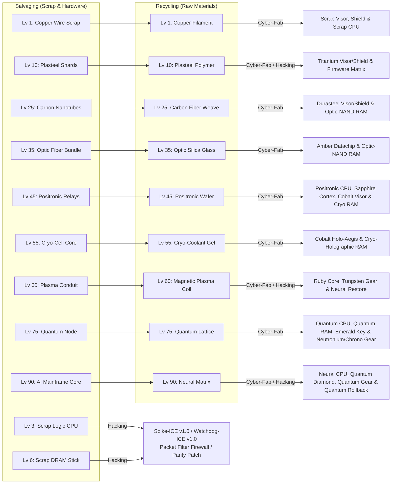
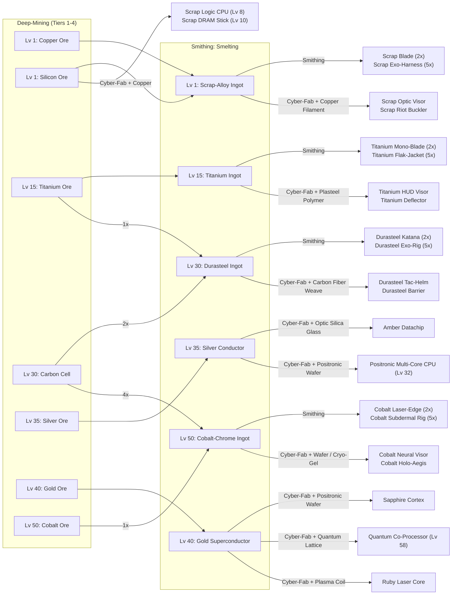
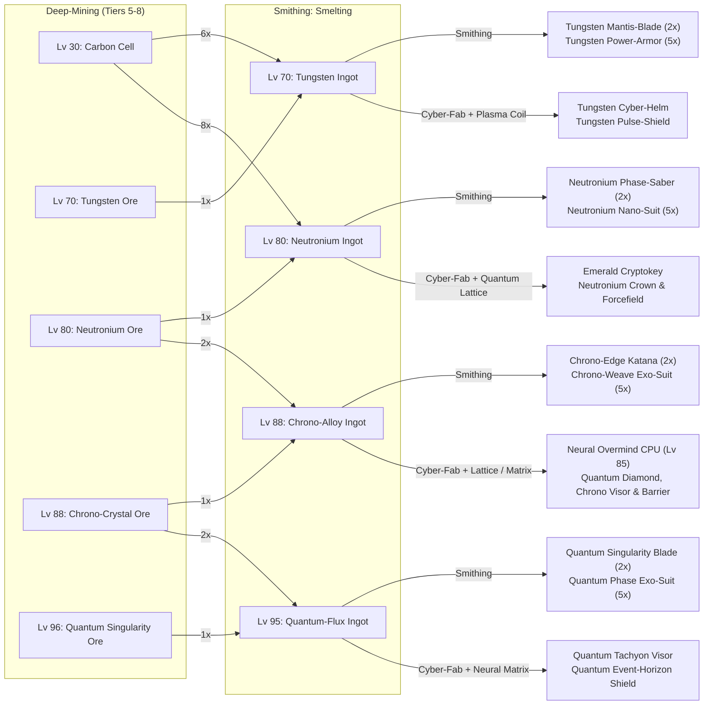
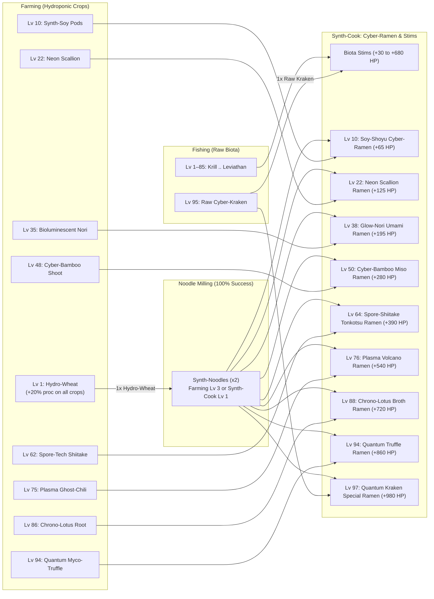

# Logistics & Production Chains

This document details all resource extraction, refinement, fabrication, and culinary logistics chains in **Routineverse**.

---

## 1. End-to-End Logistics Overview

The non-combat economy is divided into three interconnected industrial branches:
1. **Metallurgy & Cyberware Branch**: `Salvaging` + `Deep-Mining` $\rightarrow$ `Recycling` + `Smithing` $\rightarrow$ `Cyber-Fab` (Weapons, Armor, and Data Crystals).
2. **Hardware & Hacking Branch**: `Salvaging` + `Deep-Mining` + `Recycling` + `Smithing` $\rightarrow$ `Cyber-Fab` (CPUs & RAM) $\rightarrow$ `Hacking` (Attack ICE, Defense/Repair ICE, Firewalls, and Integrity Patches — see [`hacking.md`](./hacking.md)).
3. **Bio-Agri & Culinary Branch**: `Fishing` + `Farming` $\rightarrow$ `Synth-Noodles` $\rightarrow$ `Synth-Cook` (Biota Stims and Cyber-Ramen).

```mermaid
flowchart TD
  subgraph Metallurgy["Metallurgy, Hardware & Hacking Branch"]
    S["Salvaging<br/>(9 Scrap Tiers + Scrap CPU/RAM)"]
    R["Recycling<br/>(9 Raw Materials)"]
    M["Deep-Mining<br/>(10 Ores + Carbon Cell)"]
    SM_ING["Smithing: Smelting<br/>(8 Combat Alloys + 2 Conductors)"]
    SM_EQ["Smithing: Forging<br/>(8 Mono-Blades + 8 Exo-Suits)"]
    CF_EQ["Cyber-Fab: Gear<br/>(8 Visors + 8 Holo-Shields)"]
    CF_CR["Cyber-Fab: Tech Cores<br/>(5 Data Crystals)"]
    CF_HW["Cyber-Fab: Hardware<br/>(4 CPU Tiers + 4 RAM Tiers)"]
    HCK["Hacking<br/>(Attack/Defense ICE, Firewalls & Patches)"]

    S -->|"1x Scrap"| R
    S -->|"Scrap CPU / RAM"| HCK
    R -.->|"25% Bonus Proc:<br/>1x Carbon Cell"| SM_ING
    M -->|"Ores + Carbon Cells"| SM_ING
    M -.->|"8% Bonus Proc"| CF_CR
    SM_ING -->|"2x–5x Alloy Ingot"| SM_EQ
    SM_ING -->|"1x–2x Alloy Ingot"| CF_EQ
    R -->|"1x Raw Material"| CF_EQ
    SM_ING -->|"1x Conductor / Alloy"| CF_CR
    R -->|"1x Raw Material"| CF_CR
    M & R & SM_ING & CF_CR -->|"Silicon / Conductors / Wafers / Lattice"| CF_HW
    CF_HW -->|"CPUs + RAM"| HCK
  end

  subgraph Culinary["Bio-Agri & Culinary Branch"]
    BH["Fishing<br/>(9 Raw Synth-Biota)"]
    FM["Farming<br/>(9 Hydroponic Crops)"]
    HW["Hydro-Wheat<br/>(Lv 1 Crop + 20% Farming Proc)"]
    ND["Synth-Noodles<br/>(1x Hydro-Wheat -> 2x Noodles)"]
    SC_STIM["Synth-Cook: Biota Stims<br/>(9 Healing Rations/Stims)"]
    SC_RAMEN["Synth-Cook: Cyber-Ramen<br/>(9 High-Healing Ramen Bowls)"]

    BH -->|"1x Raw Biota"| SC_STIM
    FM -->|"Cultivate Lv 1<br/>or 20% Bonus Proc"| HW
    HW -->|"Farming Lv 3 or<br/>Synth-Cook Lv 1"| ND
    ND -->|"1x Synth-Noodles"| SC_RAMEN
    FM -->|"1x Crop (Soy..Truffle)"| SC_RAMEN
    BH -->|"1x Raw Cyber-Kraken"| SC_RAMEN
  end
```

---

## 2. Salvaging & Recycling Chain

**Salvaging** extracts raw tech scrap (`ItemCategory::Scrap`) as well as low-tier **CPU/RAM hardware** (`Scrap Logic CPU` at Lv 3 and `Scrap DRAM Stick` at Lv 6 for **Hacking**). **Recycling** refines scrap into `ItemCategory::RawMaterial` components used in **Cyber-Fab** and **Hacking**. Every recycling cycle also grants minor Credits and a **25% chance to recover `1x Carbon Cell`**, which feeds directly into **Smithing**.

---

## 3. Deep-Mining, Smithing & Cyber-Fab Gear & Hardware Chain (8 Tiers)

**Deep-Mining** extracts ores (`ItemCategory::RawOre`), which **Smithing** smelts into `ItemCategory::Alloy` ingots.
- **Smithing** forges offensive **Mono-Blades** (`2x Ingot`) and heavy **Exo-Suits** (`5x Ingot`).
- **Cyber-Fab** combines **Alloy Ingots** and **Ores** with **Recycled Raw Materials** to fabricate:
  - **Visors** (`1x Ingot + 1x Raw Material`) and **Holo-Shields** (`2x Ingot + 1x Raw Material`)
  - **Data Crystals** (`1x Conductor/Ingot + 1x Raw Material`)
  - **CPUs & RAM Hardware** (`Scrap Logic CPU`, `Scrap DRAM Stick`, `Positronic Multi-Core CPU`, `Optic-NAND Storage Bank`, `Quantum Co-Processor`, `Cryo-Holographic RAM`, `Neural Overmind CPU`, `Quantum Qubit Vault`) for **Hacking** (see [`hacking.md`](./hacking.md#2-hardware-components-itemcategoryhardware)).

### Tier 1–4 Metallurgy & Cyber-Fab Graph

### Tier 5–8 Metallurgy & Cyber-Fab Graph (Endgame & Quantum Tier)

---

## 4. Farming, Synth-Noodles & Cyber-Ramen Culinary Chain

The culinary system offers two parallel paths in **Synth-Cook**:
1. **Single-Input Biota Stims**: Directly synthesize aquatic `RawBiota` from **Fishing** into combat rations (`+30 HP` to `+680 HP`).
2. **Multi-Ingredient Cyber-Ramen**: Cultivate `Hydro-Wheat` in **Farming** (also obtained via a **20% bonus proc** on any hydroponic crop harvest), mill it into `2x Synth-Noodles`, and combine `1x Synth-Noodles` with hydroponic crops (or `Raw Cyber-Kraken`) to cook high-healing **Cyber-Ramen** bowls (`+65 HP` to `+980 HP`).

---

## 5. Complete Recipe Reference Tables

### Farming Protocols (`SkillType::Farming`)

| Lv | Protocol | Base Cycle | XP | Inputs | Output | Value |
|---:|----------|:----------:|---:|--------|--------|------:|
| 1 | Cultivate Hydro-Wheat | 2.8s | 14 | — | `1x Hydro-Wheat` | 4 Cr |
| 3 | Mill Synth-Noodles | 2.2s | 20 | `1x Hydro-Wheat` | `2x Synth-Noodles` | 8 Cr ea |
| 10 | Grow Synth-Soy Pods | 3.2s | 28 | — | `1x Synth-Soy Pods` | 10 Cr |
| 22 | Harvest Neon Scallion | 3.6s | 55 | — | `1x Neon Scallion` | 22 Cr |
| 35 | Culture Glow-Nori | 4.2s | 92 | — | `1x Bioluminescent Nori` | 42 Cr |
| 48 | Harvest Cyber-Bamboo | 4.8s | 145 | — | `1x Cyber-Bamboo Shoot` | 75 Cr |
| 62 | Grow Spore-Shiitake | 5.5s | 215 | — | `1x Spore-Tech Shiitake` | 130 Cr |
| 75 | Cultivate Plasma Chili | 6.5s | 330 | — | `1x Plasma Ghost-Chili` | 225 Cr |
| 86 | Harvest Chrono-Lotus | 7.6s | 490 | — | `1x Chrono-Lotus Root` | 380 Cr |
| 94 | Forage Quantum Truffle | 8.8s | 660 | — | `1x Quantum Myco-Truffle` | 650 Cr |

### Synth-Cook Protocols (`SkillType::SynthCook`)

| Lv | Protocol | Base Cycle | XP | Input 1 | Input 2 | Output | Heal | Value |
|---:|----------|:----------:|---:|---------|---------|--------|-----:|------:|
| 1 | Prep Synth-Noodles | 2.2s | 20 | `1x Hydro-Wheat` | — | `2x Synth-Noodles` | — | 8 Cr |
| 1 | Synth Krill Ration | 2.6s | 18 | `1x Raw Krill Biomass` | — | `1x Krill Ration` | +30 HP | 8 Cr |
| 5 | Synth Neon Eel | 2.8s | 34 | `1x Raw Neon Eel` | — | `1x Neon Eel Skewer` | +50 HP | 15 Cr |
| 10 | Cook Shoyu Ramen | 2.8s | 45 | `1x Synth-Noodles` | `1x Synth-Soy Pods` | `1x Soy-Shoyu Cyber-Ramen` | +65 HP | 35 Cr |
| 20 | Synth Carp Pack | 3.0s | 70 | `1x Raw Synth-Carp` | — | `1x Synth-Carp Pack` | +80 HP | 32 Cr |
| 22 | Cook Scallion Ramen | 3.0s | 85 | `1x Synth-Noodles` | `1x Neon Scallion` | `1x Neon Scallion Ramen` | +125 HP | 68 Cr |
| 35 | Synth Salmon Stim | 3.2s | 115 | `1x Raw Chrome Salmon` | — | `1x Chrome Salmon Stim` | +110 HP | 55 Cr |
| 38 | Cook Nori Ramen | 3.3s | 150 | `1x Synth-Noodles` | `1x Bioluminescent Nori` | `1x Glow-Nori Umami Ramen` | +195 HP | 135 Cr |
| 45 | Synth Lobster Meal | 3.4s | 175 | `1x Raw Cyber-Lobster` | — | `1x Cyber-Lobster Meal` | +160 HP | 100 Cr |
| 50 | Cook Bamboo Ramen | 3.5s | 220 | `1x Synth-Noodles` | `1x Cyber-Bamboo Shoot` | `1x Cyber-Bamboo Miso Ramen` | +280 HP | 230 Cr |
| 55 | Synth Plasma Ray | 3.6s | 240 | `1x Raw Plasma Ray` | — | `1x Plasma Ray Infusion` | +220 HP | 165 Cr |
| 64 | Cook Shiitake Ramen | 3.8s | 310 | `1x Synth-Noodles` | `1x Spore-Tech Shiitake` | `1x Spore-Shiitake Tonkotsu Ramen` | +390 HP | 390 Cr |
| 70 | Synth Shark Boost | 3.8s | 360 | `1x Raw Apex Shark` | — | `1x Apex Shark Booster` | +320 HP | 300 Cr |
| 76 | Cook Plasma Chili Ramen | 4.1s | 440 | `1x Synth-Noodles` | `1x Plasma Ghost-Chili` | `1x Plasma Volcano Ramen` | +540 HP | 680 Cr |
| 85 | Synth Leviathan Med | 4.2s | 540 | `1x Raw Leviathan Cell` | — | `1x Leviathan Nanomed` | +480 HP | 550 Cr |
| 88 | Cook Chrono-Lotus Ramen | 4.4s | 620 | `1x Synth-Noodles` | `1x Chrono-Lotus Root` | `1x Chrono-Lotus Broth Ramen` | +720 HP | 1,150 Cr |
| 94 | Cook Truffle Ramen | 4.6s | 780 | `1x Synth-Noodles` | `1x Quantum Myco-Truffle` | `1x Quantum Truffle Ramen` | +860 HP | 1,850 Cr |
| 95 | Synth Kraken Elixir | 4.6s | 720 | `1x Raw Cyber-Kraken` | — | `1x Kraken Bio-Elixir` | +680 HP | 950 Cr |
| 97 | Cook Kraken Ramen | 4.8s | 880 | `1x Synth-Noodles` | `1x Raw Cyber-Kraken` | `1x Quantum Kraken Special Ramen` | +980 HP | 2,200 Cr |
